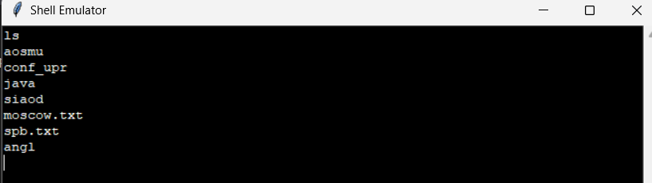
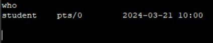
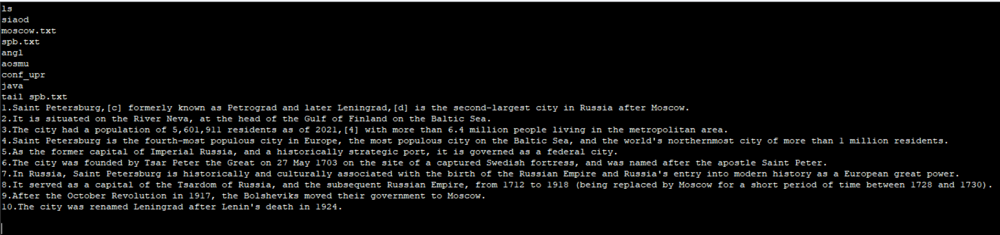
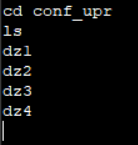
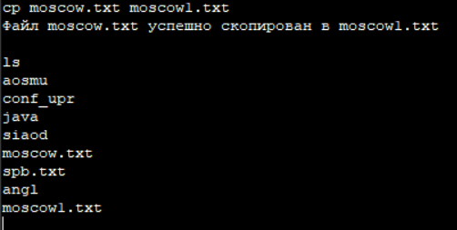
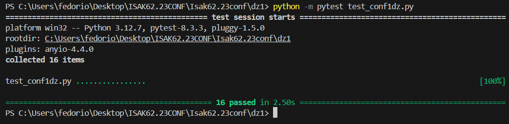

# Документация по 1 ДЗ
https://github.com/fedorio00/Isak62.23conf

## 1. Общее описание
Данный проект представляет собой эмулятор командной оболочки, реализованный с использованием Python и библиотеки Tkinter для графического интерфейса. Эмулятор поддерживает основные команды, такие как `ls`, `cd`, `exit`, `who`, `tail` и `cp`, позволяя пользователю взаимодействовать с виртуальной файловой системой, хранящейся в tar-архиве.

## 2. Описание всех функций и настроек
- **ShellEmulator**: Основной класс, реализующий функциональность эмулятора.
  - `__init__(self, config_path, output_widget)`: Инициализация эмулятора с загрузкой конфигурации и виртуальной файловой системы.
  - `_load_config(self, config_path)`: Загрузка конфигурации из TOML файла.
  - `_load_virtual_fs(self)`: Загрузка виртуальной файловой системы из tar-архива.
  - `do_ls(self, args)`: Реализация команды `ls` для отображения содержимого текущего каталога.
  - `do_cd(self, args)`: Реализация команды `cd` для смены текущего каталога.
  - `do_exit(self, args)`: Выход из эмулятора.
  - `do_who(self, args)`: Показ пользователей, вошедших в систему.
  - `do_tail(self, args)`: Показ последних строк указанного файла.
  - `do_cp(self, args)`: Копирование файла или каталога.

## 3. Описание команд для сборки проекта
Для запуска проекта необходимо установить библиотеки:
- toml
- pytest

## 4. Примеры использования в виде скриншотов

## 5. Описание тестов
- **test_ls_root**: Проверяет, что команда `ls` отображает корневую директорию.
- **test_ls_subdir**: Проверяет, что команда `ls` отображает файлы в подкаталоге.
- **test_ls_empty_dir**: Проверяет, что команда `ls` возвращает пустой вывод для пустого каталога.
- **test_cd_root**: Проверяет, что команда `cd` возвращает в корневую директорию.
- **test_cd_subdir**: Проверяет, что команда `cd` переходит в подкаталог.
- **test_cd_nonexistent**: Проверяет, что команда `cd` возвращает сообщение об ошибке для несуществующего каталога.
- **test_exit**: Проверяет, что команда `exit` закрывает окно эмулятора.
- **test_who_output**: Проверяет, что команда `who` отображает информацию о пользователе.
- **test_who_with_args**: Проверяет, что команда `who` работает с аргументами.
- **test_who_format**: Проверяет формат вывода команды `who`.
- **test_tail_nonexistent_file**: Проверяет, что команда `tail` возвращает сообщение об ошибке для несуществующего файла.
- **test_tail_no_args**: Проверяет, что команда `tail` возвращает сообщение об использовании без аргументов.
- **test_tail_empty_file**: Проверяет, что команда `tail` возвращает сообщение об использовании для пустого файла.
- **test_cp_no_args**: Проверяет, что команда `cp` возвращает сообщение об использовании без аргументов.
- **test_cp_nonexistent_source**: Проверяет, что команда `cp` возвращает сообщение об ошибке для несуществующего источника.
- **test_cp_file**: Проверяет, что команда `cp` успешно копирует файл.

## 6. Результаты прогона тестов
Тесты для эмулятора написаны с использованием библиотеки `pytest`. Для запуска тестов выполните команду:
- python -m pytest test_conf1dz.py
