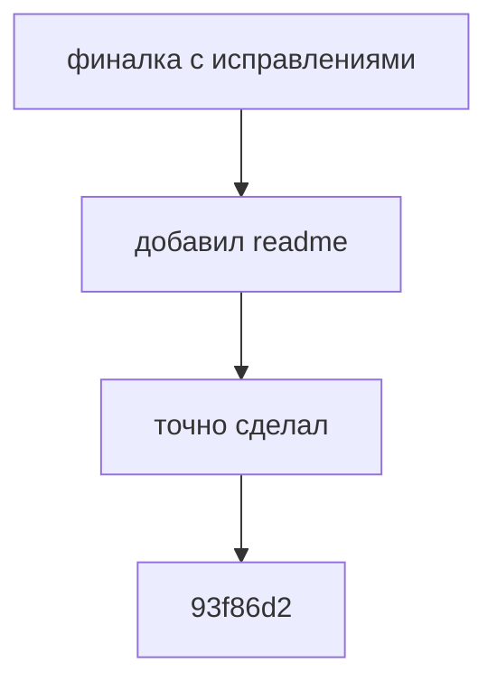
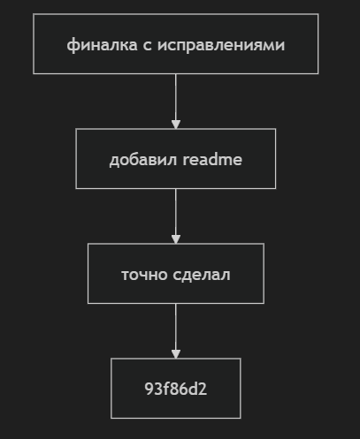

# Git Graph Visualizer

## Общее описание
Инструмент командной строки для визуализации графа зависимостей коммитов в git-репозитории. Программа анализирует историю изменений указанного файла и создает граф зависимостей между коммитами в формате Mermaid. Это помогает лучше понять историю изменений файла и связи между коммитами.

## Особенности
- Использует только стандартные библиотеки Python
- Не требует установки дополнительных зависимостей
- Поддерживает работу с русскими символами в сообщениях коммитов
- Генерирует граф в формате Mermaid

## Функции

### Основные функции
1. `parse_toml(config_path)`: Загрузка конфигурации из TOML файла
   - Простой встроенный парсер TOML
   - Поддержка базовой структуры с секциями

2. `get_file_history(repo_path, file_path)`: Получение истории коммитов
   - Отслеживает историю указанного файла
   - Возвращает список коммитов с хешами и сообщениями

3. `get_commit_parents(repo_path, commit_hash)`: Получение родительских коммитов
   - Находит родительские коммиты для указанного коммита
   - Поддерживает работу с merge-коммитами

4. `generate_mermaid(commits)`: Генерация Mermaid-диаграммы
   - Создает узлы для каждого коммита
   - Устанавливает связи между коммитами
   - Корректно обрабатывает специальные символы

### Настройки (config.toml)
```toml
[paths]
repository = "./repo-path"      # Путь к git репозиторию
target_file = "example.txt"    # Файл для анализа
output = "output.md"           # Выходной файл с диаграммой
visualizer = "mermaid-cli"     # Инструмент для визуализации
```

## Использование

1. Клонирование репозитория:
```bash
git clone https://github.com/fedorio00/Isak62.23conf.git
cd Isak62.23conf/dz2
```

2. Настройка конфигурации:
   - Отредактируйте файл `config.toml`:
   ```toml
   [paths]
   repository = "путь/к/вашему/репозиторию"
   target_file = "имя_файла_для_анализа"
   output = "dependency_graph.md"
   visualizer = "mermaid-cli"
   ```

3. Запуск программы:
```bash
python git_graph.py
```

## Пример вывода



Этот граф показывает:
- Узлы - коммиты с их сообщениями
- Стрелки - связи между коммитами (родитель --> потомок)
- История изменений отображается сверху вниз

Графическое отображение графа:

## Тестирование
Проект включает набор тестов, покрывающих все основные функции:
- ✅ Парсинг TOML конфигурации
- ✅ Получение истории файла
- ✅ Получение родительских коммитов
- ✅ Генерация Mermaid-диаграммы
- ✅ Полный процесс визуализации

Запуск тестов:
```bash
python -m pytest test_git_graph.py -v
```
Результаты тестов:

## Структура проекта
```
dz2/
├── git_graph.py          # Основной модуль
├── test_git_graph.py     # Тесты
├── config.toml           # Конфигурационный файл
├── dependency_graph.md   # Сгенерированный граф
└── README.md            # Документация
```

## Ссылки
- [Исходный код](https://github.com/fedorio00/Isak62.23conf/tree/main/dz2)
