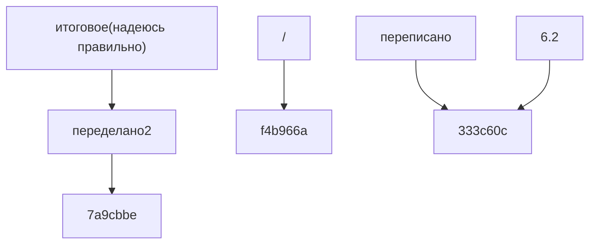
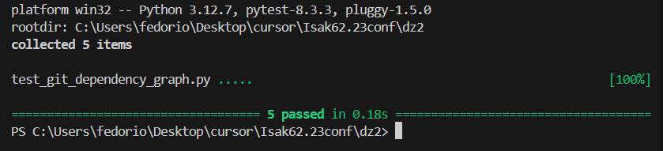

# Git Dependency Graph Visualizer

## Общее описание
Инструмент командной строки для визуализации графа зависимостей коммитов в git-репозитории. Программа анализирует историю изменений указанного файла и создает граф зависимостей между коммитами в формате Mermaid. Это помогает лучше понять историю изменений файла и связи между коммитами.

## Функции и настройки

### Основные функции
1. `_get_file_history(file_path)`: Получение полной истории коммитов для указанного файла
   - Отслеживает переименования файла
   - Возвращает список коммитов с их хешами и сообщениями

2. `_get_commit_parents(commit_hash)`: Получение родительских коммитов
   - Находит все родительские коммиты для указанного коммита
   - Поддерживает работу с merge-коммитами (множественные родители)

3. `generate_mermaid(commits)`: Генерация Mermaid-диаграммы
   - Создает узлы для каждого коммита
   - Устанавливает связи между коммитами на основе их родительских отношений
   - Поддерживает экранирование специальных символов

4. `visualize()`: Основной метод визуализации
   - Собирает историю коммитов
   - Строит граф зависимостей
   - Сохраняет результат в Markdown-файл

### Настройки (config.toml)
```toml
[paths]
visualizer = "mermaid-cli"     # Инструмент для визуализации
repository = "./repo-path"      # Путь к git репозиторию
output = "output.md"           # Выходной файл с диаграммой
target_file = "example.txt"    # Файл для анализа
```

## Сборка и установка

1. Клонирование репозитория:
```bash
git clone https://github.com/fedorio00/Isak62.23conf.git
cd Isak62.23conf/dz2
```

2. Установка зависимостей:
```bash
pip install -r requirements.txt
```

3. Настройка конфигурации:
   - Создай файл `config.toml` со следующим содержимым:
   ```toml
   [paths]
   visualizer = "mermaid-cli"     # Инструмент для визуализации
   repository = "./repo-path"      # Путь к git репозиторию
   output = "output.md"           # Выходной файл с диаграммой
   target_file = "example.txt"    # Файл для анализа
   ```
   - Измени пути в конфигурации под свой проект

## Примеры использования

### 1. Анализ истории файла

Для анализа истории файла нужно:

1. Настроить конфигурацию в `config.toml`:
```toml
[paths]
visualizer = "mermaid-cli"
repository = "путь/к/вашему/репозиторию"
output = "dependency_graph.md"
target_file = "имя_файла_для_анализа"
```

2. Запустить программу:
```bash
python git_dependency_graph.py
```

3. Результат будет сохранен в файл `dependency_graph.md` и выведен в консоль:



Этот граф показывает:
- Каждый узел представляет коммит с его сообщением
- Стрелки показывают связи между коммитами (родитель --> потомок)
- История изменений отображается сверху вниз

### 2. Интерпретация результатов
- Узлы графа - это коммиты с их сообщениями
- Стрелки показывают, из какого коммита был создан новый коммит
- Можно увидеть ветвление (когда у коммита несколько потомков)
- Слияния видны, когда у коммита несколько родителей

## Результаты тестов


### Покрытие тестами
- ✅ Загрузка конфигурации
- ✅ Получение истории файла
- ✅ Получение родительских коммитов
- ✅ Генерация Mermaid-диаграммы
- ✅ Полный процесс визуализации

## Структура проекта
```
dz2/
├── git_dependency_graph.py   # Основной модуль
├── config.toml              # Конфигурационный файл
├── requirements.txt         # Зависимости проекта
├── test_git_dependency_graph.py  # Тесты
└── README.md               # Документация
```

## Ссылки
- [Исходный код](https://github.com/fedorio00/Isak62.23conf/tree/main/dz2)
