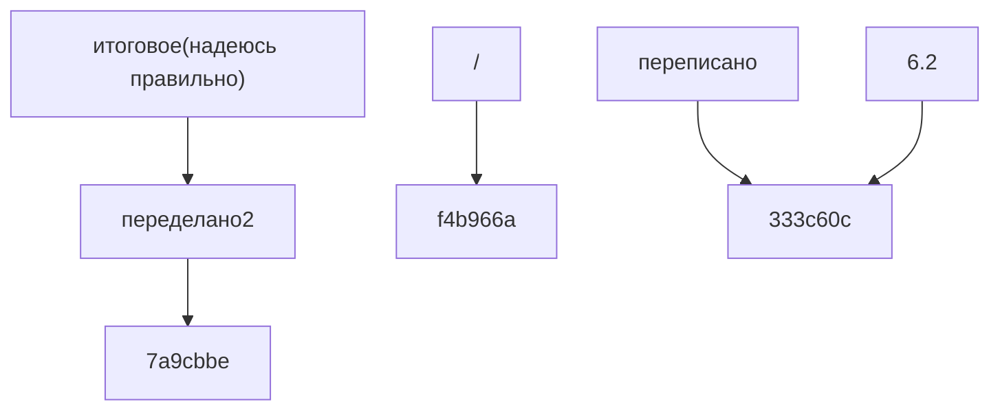

```mermaid
graph TD;
    3bd99e3["/"]
    ad03d09["итоговое(надеюсь правильно)"]
    862fd6c["переделано2"]
    c0b1e04["переписано"]
    cceffeb["6.2"]
    3bd99e3 --> f4b966a
    ad03d09 --> 862fd6c
    862fd6c --> 7a9cbbe
    c0b1e04 --> 333c60c
    cceffeb --> 333c60c
```
