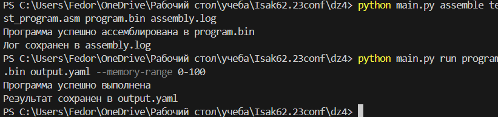
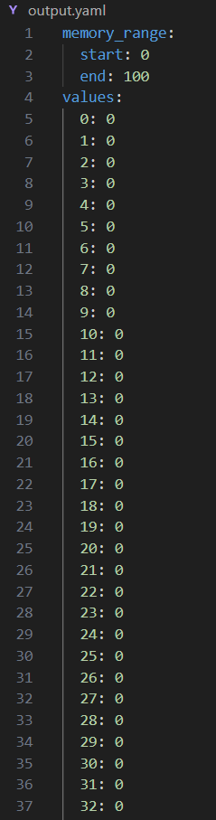
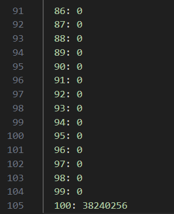

# Учебная виртуальная машина (УВМ)

## Общее описание

Данный проект представляет собой реализацию учебной виртуальной машины с ассемблером. УВМ поддерживает базовый набор команд для работы с памятью и операцию bitreverse. Проект включает в себя ассемблер для трансляции программ из текстового формата в бинарный код и интерпретатор для выполнения скомпилированных программ.

### Архитектура системы

Проект состоит из трех основных компонентов:
1. **Ассемблер** - транслирует программы из текстового формата в бинарный код
2. **Виртуальная машина** - исполняет бинарный код программы
3. **Командный интерфейс** - обеспечивает взаимодействие с системой через командную строку

## Функции и настройки

### Основные компоненты

1. **Ассемблер** (`assembler.py`)
   - Транслирует программы из ассемблерного кода в бинарный формат
   - Генерирует лог-файл процесса ассемблирования
   - Поддерживает все базовые инструкции УВМ
   - Выполняет проверку синтаксиса исходного кода
   - Сообщает об ошибках с указанием строки и типа ошибки

2. **Виртуальная машина** (`interpreter.py`)
   - Размер памяти по умолчанию: 4096 слов
   - Поддерживаемые инструкции:
     - `LOAD_CONST` - загрузка константы в память
     - `READ_MEMORY` - чтение из памяти
     - `WRITE_MEMORY` - запись в память
     - `BITREVERSE` - операция побитового разворота числа
   - Контроль выхода за границы памяти
   - Отслеживание состояния программного счетчика

3. **Командный интерфейс** (`main.py`)
   - Предоставляет CLI для работы с УВМ
   - Поддерживает команды ассемблирования и выполнения программ
   - Обработка ошибок пользовательского ввода
   - Генерация понятных сообщений об ошибках

### Поддерживаемые команды ассемблера

```assembly
LOAD addr, const    ; Загрузка константы const по адресу addr
READ dest, src, off ; Чтение из памяти по адресу src+off в dest
WRITE src, dest     ; Запись значения из src по адресу dest
BITREV dest, src    ; Побитовый разворот числа из src в dest
```

## Сборка и запуск

### Требования
- Библиотеки: click, pyyaml

### Установка зависимостей
```bash
pip install click pyyaml
```

### Команды

1. **Ассемблирование программы:**
```bash
python main.py assemble test_program.asm program.bin assembly.log
```
Где:
- `test_program.asm` - путь к исходному файлу с программой
- `output.bin` - путь для сохранения бинарного файла
- `assembly.log` - путь для сохранения лога ассемблирования

2. **Выполнение программы:**
```bash
python main.py run program.bin output.yaml --memory-range 0-1000
```
Где:
- `program.bin` - путь к бинарному файлу программы
- `output.yaml` - путь для сохранения результатов работы программы
- `--memory-range` - диапазон памяти для сохранения в output.yaml

## Примеры использования

### Пример программы
```assembly
; Тестовая программа для выполнения bitreverse
LOAD 100, 123456    ; загрузка тестового значения
BITREV 100, 100     ; выполнение операции bitreverse
```

### Формат выходного файла
После выполнения программы результаты сохраняются в YAML-файл в следующем формате:
```yaml
memory_range:
  start: 100    # Начальный адрес диапазона памяти
  end: 100      # Конечный адрес диапазона памяти
values:
  100: 12345    # Значения памяти в формате "адрес: значение"
```

Путь сохранения YAML-файла можно указать:
- Относительный путь: `output.yaml` (в текущей директории)
- Путь в поддиректории: `results/memory_dump.yaml`
- Абсолютный путь: `C:/path/to/output.yaml`

## Тестирование


